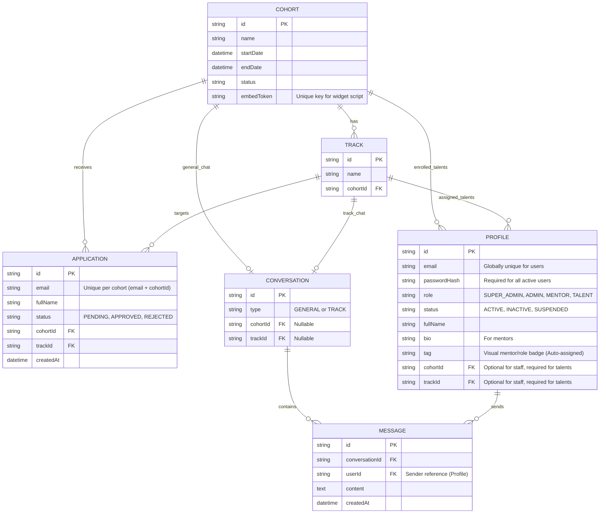

```mermaid
erDiagram
    COHORT {
        string id PK
        string name
        datetime startDate
        datetime endDate
        string status
        string embedToken "Unique key for widget script"
    }

    TRACK {
        string id PK
        string name
        string cohortId FK
    }

    APPLICATION {
        string id PK
        string email "Unique per cohort (email + cohortId)"
        string fullName
        string status "PENDING, APPROVED, REJECTED"
        string cohortId FK
        string trackId FK
        datetime createdAt
    }

    PROFILE {
        string id PK
        string email "Globally unique for users"
        string passwordHash "Required for all active users"
        string role "SUPER_ADMIN, ADMIN, MENTOR, TALENT"
        string status "ACTIVE, INACTIVE, SUSPENDED"
        string fullName
        string bio "For mentors"
        string tag "Visual mentor/role badge (Auto-assigned)"
        string cohortId FK "Optional for staff, required for talents"
        string trackId FK "Optional for staff, required for talents"
    }

    CONVERSATION {
        string id PK
        string type "GENERAL or TRACK"
        string cohortId FK "Nullable"
        string trackId FK "Nullable"
    }

    MESSAGE {
        string id PK
        string conversationId FK
        string userId FK "Sender reference (Profile)"
        text content
        datetime createdAt
    }

    COHORT ||--o{ TRACK : "has"
    COHORT ||--o{ APPLICATION : "receives"
    TRACK ||--o{ APPLICATION : "targets"
    COHORT ||--o{ PROFILE : "enrolled_talents"
    TRACK ||--o{ PROFILE : "assigned_talents"
    COHORT ||--o| CONVERSATION : "general_chat"
    TRACK ||--o| CONVERSATION : "track_chat"
    CONVERSATION ||--o{ MESSAGE : "contains"
    PROFILE ||--o{ MESSAGE : "sends"
```
