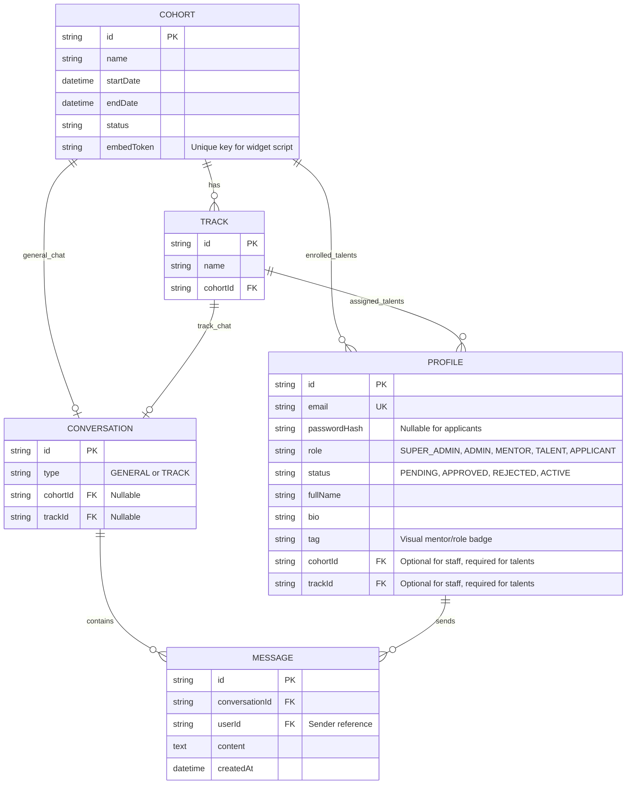

```mermaid
erDiagram
COHORT {
string id PK
string name
datetime startDate
datetime endDate
string status
string embedToken "Unique key for widget script"
}

    TRACK {
        string id PK
        string name
        string cohortId FK
    }

    PROFILE {
        string id PK
        string email UK
        string passwordHash "Nullable for applicants"
        string role "SUPER_ADMIN, ADMIN, MENTOR, TALENT, APPLICANT"
        string status "PENDING, APPROVED, REJECTED, ACTIVE"
        string fullName
        string bio
        string tag "Visual mentor/role badge"
        string cohortId FK "Optional for staff, required for talents"
        string trackId FK "Optional for staff, required for talents"
    }

    CONVERSATION {
        string id PK
        string type "GENERAL or TRACK"
        string cohortId FK "Nullable"
        string trackId FK "Nullable"
    }

    MESSAGE {
        string id PK
        string conversationId FK
        string userId FK "Sender reference"
        text content
        datetime createdAt
    }

    COHORT ||--o{ TRACK : "has"
    COHORT ||--o{ PROFILE : "enrolled_talents"
    TRACK ||--o{ PROFILE : "assigned_talents"
    COHORT ||--o| CONVERSATION : "general_chat"
    TRACK ||--o| CONVERSATION : "track_chat"
    CONVERSATION ||--o{ MESSAGE : "contains"
    PROFILE ||--o{ MESSAGE : "sends"
```
